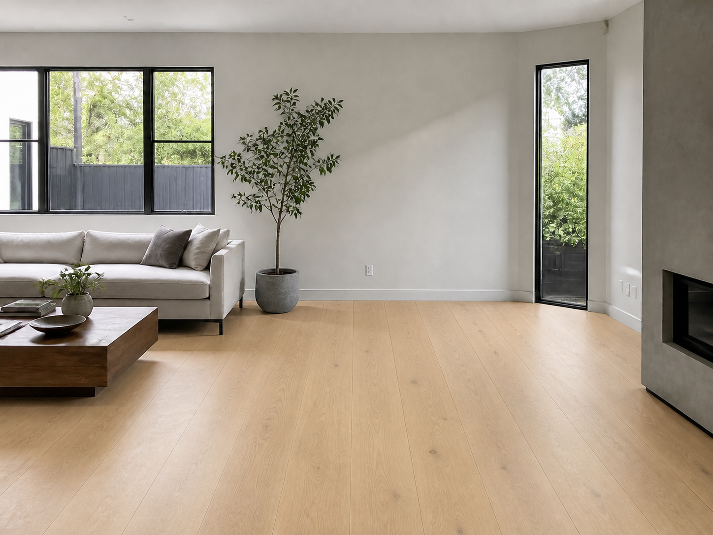

# FloorSight

FloorSight is an independent AI-assisted portfolio project by Venkata Karthik Samula for previewing flooring materials in room photographs.

> This project is not affiliated with or endorsed by Home Depot or any other retailer.



## What works

- Upload a JPG, PNG, or WebP room image.
- Choose from a small flooring texture catalogue.
- Use a sample room for an immediate demonstration.
- Generate an offline concept preview with Pillow.
- Optionally request a generative edit from Gemini.
- View and download the resulting image.
- Receive clear errors for invalid files, oversized uploads, missing configuration, and unavailable catalogue entries.

## Architecture

```text
Browser form
    |
    v
Flask request validation
    |
    +--> Local Pillow compositor
    |
    +--> Gemini multimodal image editor
    |
    v
Generated image in ignored output storage
    |
    v
Result and download page
```

## Repository layout

```text
apps/
  flask-gemini/       Working interactive prototype
  gcs-gemini/         Exploratory Google Cloud Storage batch prototype
experiments/
  sam2-openai/        Incomplete segmentation and compositing experiment
docs/
  architecture/       Original architecture diagrams
  project-notes/      Sanitized project overview
docs/PROJECT_SCOPE.md Included components and project boundaries
```

## Run locally

Python 3.11 or newer is recommended.

```bash
python -m venv .venv
source .venv/bin/activate
pip install -r apps/flask-gemini/requirements.txt
python apps/flask-gemini/app.py
```

Open `http://127.0.0.1:8000` and use **Local preview**. No API key is required.

## Enable Gemini rendering

Copy the example environment file and provide a valid key:

```bash
cp .env.example .env
```

Set these values in `.env`:

```dotenv
GEMINI_API_KEY=your-key
GEMINI_MODEL=gemini-2.5-flash-image
```

The model name is configurable because model availability changes over time. The Gemini implementation follows the official [Google Gen AI Python SDK](https://googleapis.github.io/python-genai/) and [Gemini image generation documentation](https://ai.google.dev/gemini-api/docs/image-generation).

## Run tests

```bash
cd apps/flask-gemini
../../.venv/bin/python -m unittest discover -s tests -v
```

The test suite covers page rendering, local image generation, invalid uploads, and catalogue path validation.

## Prototype boundaries

Local preview is a deterministic demonstration, not photorealistic floor segmentation. It applies a texture to an approximate lower-room mask. Gemini mode can produce more realistic results, but generative output is probabilistic and may modify objects outside the requested floor region.

The GCS and SAM2 folders document additional approaches explored during development. They are not represented as production-ready components.

## Security and privacy

- API keys are loaded from environment variables and excluded from Git.
- Uploads are limited to 12 MB and validated as images.
- Catalogue paths are normalized before access.
- Generated output is ignored by Git.
- Production deployment would still require authentication, retention controls, malware scanning, rate limiting, private object storage, and scheduled cleanup.

## Responsible use

Generated previews are illustrative and may differ from physical materials after installation. Confirm flooring with a real sample under the room's lighting before purchase.

## Asset provenance

The room, flooring textures, and example output included in the public repository were generated specifically for this portfolio project. See [ASSET_PROVENANCE.md](docs/ASSET_PROVENANCE.md) for the asset inventory and generation notes.
